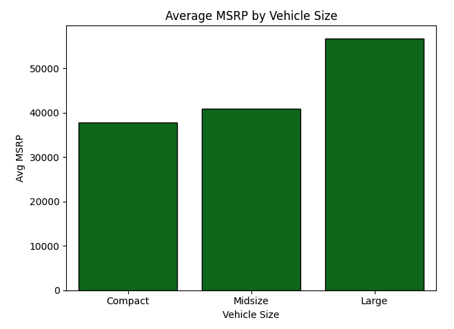
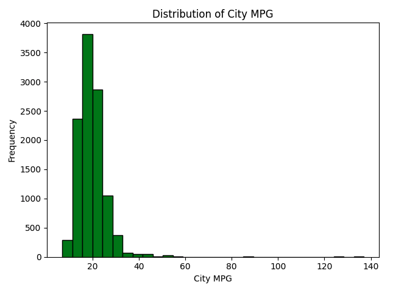
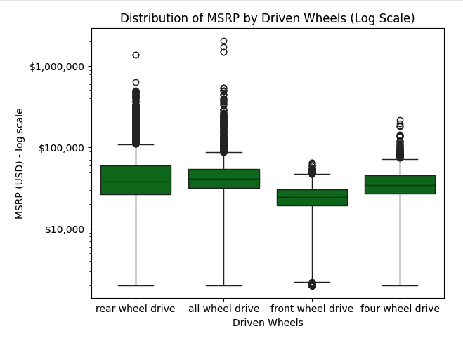
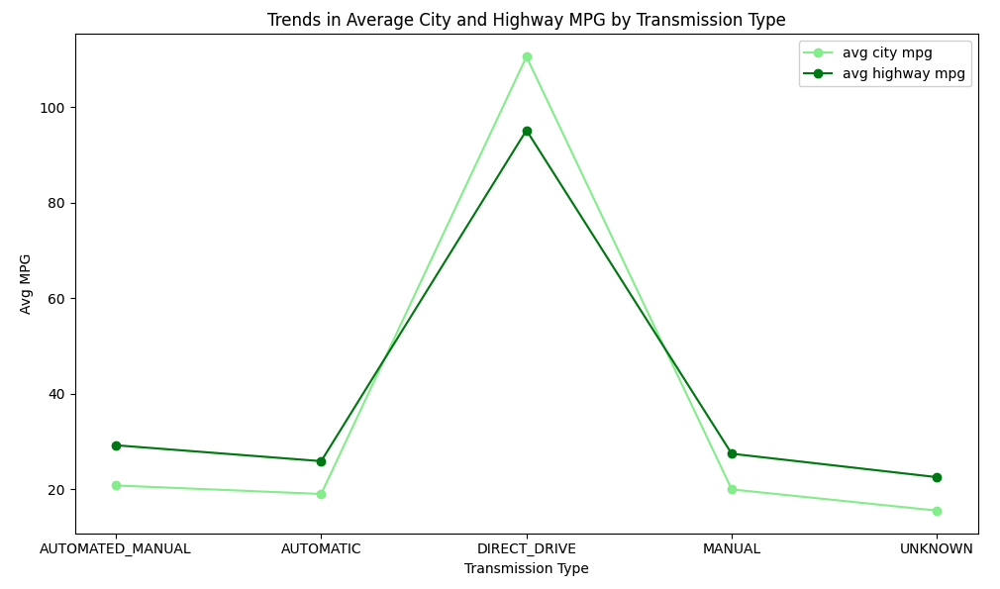

# Car Market Analysis: Engine Performance, Pricing & Fuel Efficiency

## 🚗 Introduction 

The car dataset contains detailed information on a wide range of vehicles, including technical specifications, pricing, and fuel efficiency metrics. Key attributes include manufacturer suggested retail price (MSRP), engine horsepower (HP), drivetrain configuration, transmission type, vehicle size, and city and highway fuel economy. The dataset spans multiple manufacturers and vehicle segments, offering a broad view of the automotive market. The analysis focuses on vehicles manufactured from 1995 onwards and applies data cleaning, feature engineering, exploratory data analysis (EDA), and visualization techniques using Python.

## 🗂️ Dataset

- Source: public car dataset
- Size: ~ 11,000 vehicles
- Time span: 1995+

## 🎯 Objectives

- clean dataset incl. handling missing values and filtering by model year
- engineer neaningful features such as total miles per gallon (MPG) and price per HP
- understand how vehicle characteristics influence manufacturer suggested retail price (MSRP) and fuel efficiency
- identify patterns across vehicle size, drivetrain, and engine performance 

## ⚙️ Methodology

- remove or impute missing values based on proportion and analytical relevance
- filter the dataset to include vehicles from model year 1995 and later
- standardize categorical text fields for cosistency
- create derived features to capture efficiency and pricing dynamics
- use descriptive statistics, grouping, correlation analysis, and visualization to identify patterns 

## 🧩 Technologies & Tools

- Python
- Pandas
- Seaborn
- Matplotlib
- Jupiter Notebook / Google Colab 

## 📊 Visualizations

### Average MSRP by Vehicle Size
*Pricing differences across market segments*

### Engine HP vs MSRP
*Relationship between vehicle performance and price*

### Distribution of City MPG
Frequency of City Miles Per Gallon*

### Distribution of MSRP by Driven Wheels - log scale
*Pricing differences across drivetrain configurations*

### Average City and Highway MPG by Transmission Type
*Trends in average City MPG and Highway MPG for different Transmission Types*

## 🔍 Insights

The analysis shows clear relationships between vehicle characteristics, pricing, and efficiency. 

- MSRP increases with both vehicle size and engine performance: large vehicles have the highest average MSRP (approximately $56,000), followed by midsize (about $41,000) and compact vehicles (about $38,000). 
- Engine horsepower (HP) is strongly correlated with MSRP (r ≈ 0.65), with vehicles under 200 HP typically priced below $50,000, while vehicles exceeding 600 HP often surpass $300,000.
- Drivetrain choice further affects pricing, as rear-wheel drive and all-wheel drive vehicles have higher median MSRPs (around $44,000 and $43,000) than front-wheel drive vehicles (approximately $27,000).
- Fuel efficiency trends highlight important design trade-offs. City MPG values are mostly concentrated between 15 and 25 MPG, with a right-skewed distribution driven by a small number of highly efficient vehicles.
- Transmission type influences efficiency, with manual transmissions averaging approximately 20 MPG city and 28 MPG highway, slightly outperforming automatic transmissions (19 MPG city, 26 MPG highway). Direct-drive transmissions exhibit exceptionally high MPG values, reflecting electric powertrains rather than conventional combustion engines.

## 💡 Recommendations

- Based on the findings, consumers seeking lower purchase costs and better fuel efficiency may benefit from choosing smaller, front-wheel drive vehicles with manual or efficient automatic transmissions. 
- Manufacturers aiming to balance performance and affordability should consider optimizing horsepower gains against fuel economy losses, particularly in midsize vehicle segments.
- From a policy and sustainability perspective, the strong efficiency performance of direct-drive (electric) vehicles suggests continued investment and development in electric powertrain technologies could significantly improve overall fleet fuel efficiency.

## 🗂️  Directory Structure

├── raw-data/
│      ├── car-dataset.csv
│
├── analysis/
│      ├── car-market-analysis.ipynb
│
├── visuals/
│      └── AVG-City-and-Highway-MPG-by-Transmission-Type.png
│      └── AVG-MSRP-by-Vehicle-Size.png
│      └── Distribution-of-City-MPG.png
│      └── Distribution-of-MSRP-by-Driven-Wheels-log-scale.png
│      └── Engine-HP-vs-MSRP.png
│
├── README.md
│
└── .gitattributes

## 🪪 License

This project is licensed for **educational and demonstration purposes only**. All data used is **fictional** and does not represent real business information.

